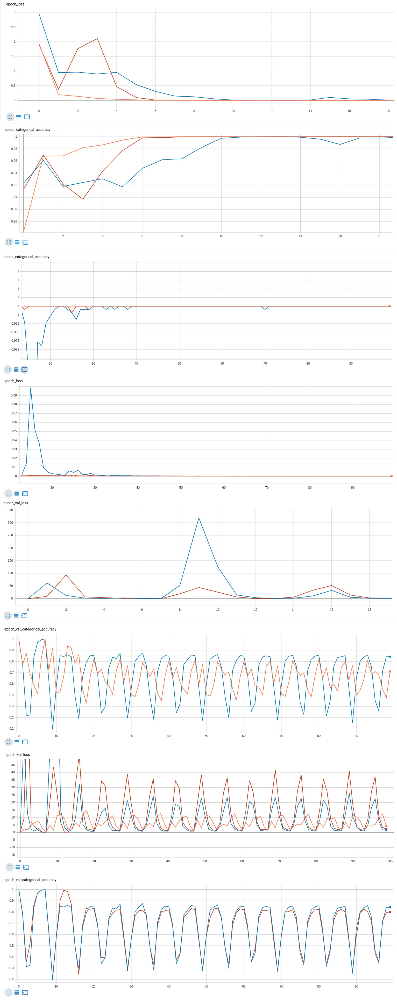
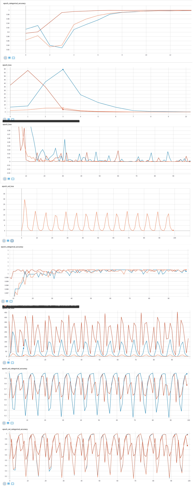
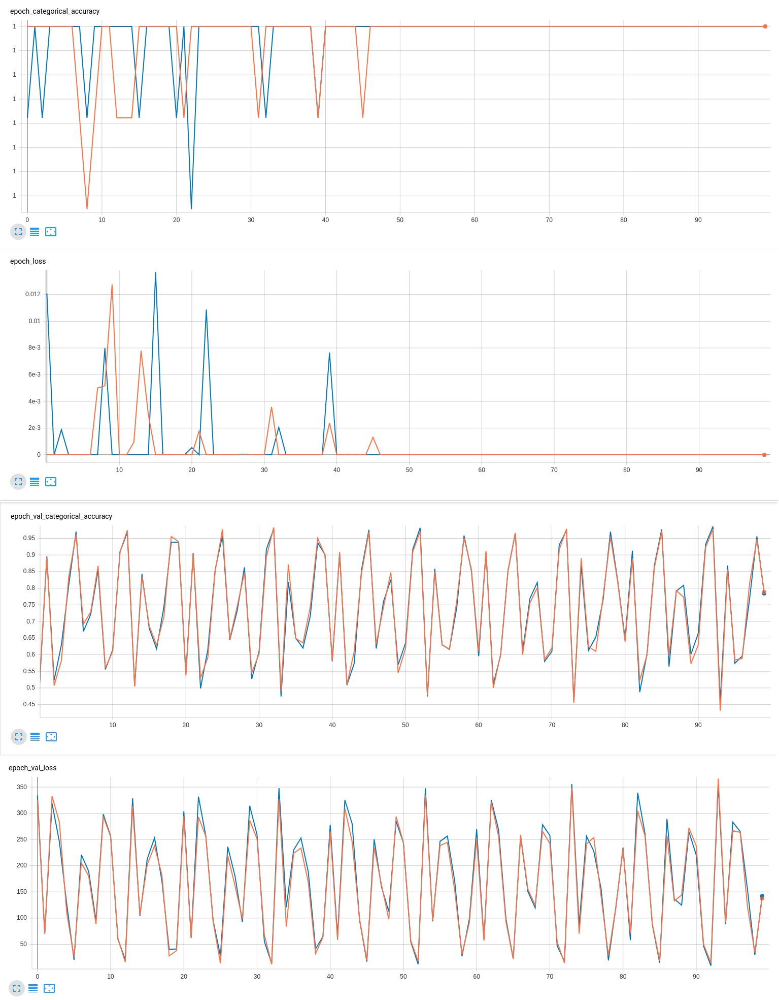
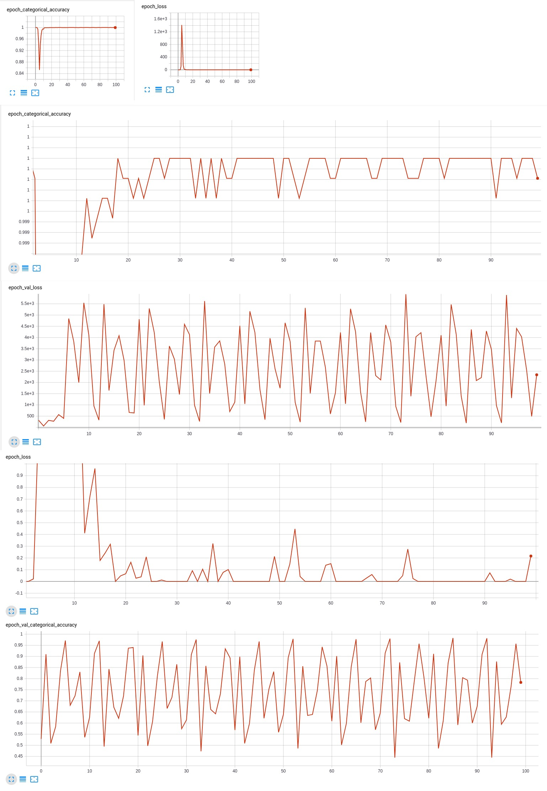

# lab 3

## Пункт 2a

Оранжевый - 0.0001   
Синий - 0.0005   
Красный - 0.0009   
На обучающей выборке синий сходится быстрее всех,но имеет два выброса по точности после схождения. Оранжевый же показывает стабильность на обучающей
выборке(нет выбросов), сходится после синего. Точность на валидационной выборке у синего высота пиков меньшая, в то время как 
оранжевый и красный практически одинаковы. А вот ошибка на валидационной выборке обратная ситуация: синий наглядно имеет  значительной высокие пики
по сравнению с другими. В тоже время красный и оранжевый практически одинаковы, но оранжевые пики находятся под красными.

##### Вывод
Оптимальный вариант с лёрнинг рейтом 0.0001

## Пункт 3с

Оранжевый - 0.0001   
Синий - 0.0008   
Красный - 0.0003   
Оранжевый на обучающей выборке сходится быстрее всех. Так же он имеем меньший разброс точности на валидационной выборке по сравнению с другими, а имеет меньшую ошибку
на валидационной выборке, чем другие: скачки самые низкие. Синий имеет выбросы на обучающей выборке, в то время как другие уже сошлись.
Синий и красный на валидационной точности имею приблизительно одинаковые графики, но пики у красного ниже, а вот на валидационной
ошибке - наоборот, пики синего намного ниже.
##### Вывод
Оптимальный вариант с лёрнинг рейтом 0.0001

## Пункт 3d

Оранжевый - 0.0001   
Синий - 0.001 
Красный - 0.01   
Красный: точность на обучающей выборке - сходится быстрее всех, но в тоже время ошибка на обучающей выборке - имеет выброс
и очевидно оранжевый быстрее сходится. Так же красный имеет меньший разброс на валидационной точности по сравнению с синим и оранжевым,
который повторяют друг друга. Оранжевый показывает хорошую ошибку на валидационной выборке, по сравнению с другими. В тоже 
время оранжевый ведёт себя на обучающей выборке более стабильно(меньше выбросов).

##### Вывод
Оптимальный вариант с лёрнинг рейтом 0.0001

## Пункт 3e

Оранжевый - 0.001   
Синий - 0.0001 
На валидационной выборке синий и оранжевый ведут себя  практически одинаково. Но оранжевый имеет более меньшие
пики на фоне синего. На обучающей выборке у синего сразу начинаются выбросы и их больше, чем у оранжевого..

Красный - 0.1  
Очевидно, что лёрнинг рейт слишком большой: на обучающей выборке видны очень большие выбросы. Дальнейшее рассмотрение не имеет смысла.

##### Вывод
Оптимальный вариант с лёрнинг рейтом 0.001